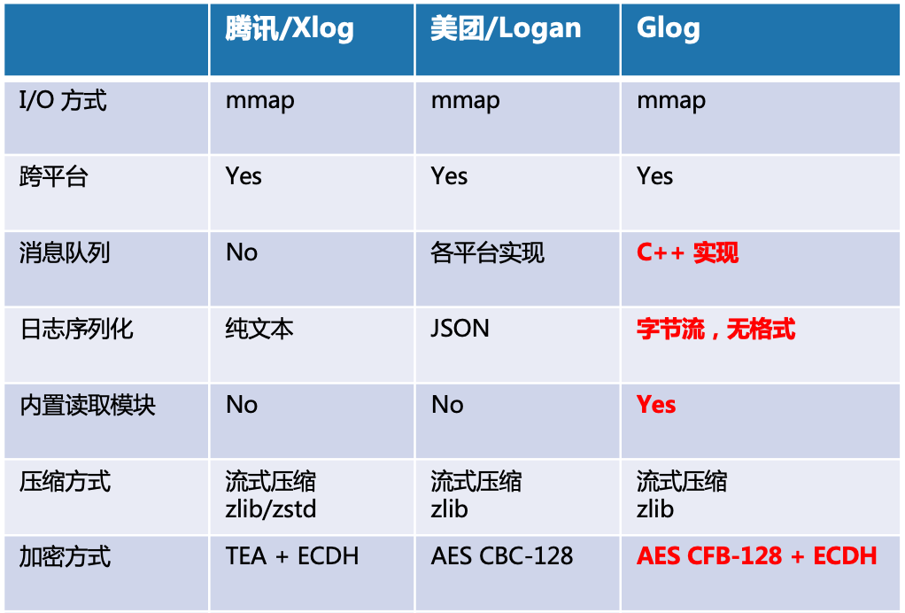

<h1 align="center">

</h1>

[](https://github.com/HuolalaTech/Glog)
[](https://raw.githubusercontent.com/HuolalaTech/Glog/master/LICENSE) 
[](https://github.com/HuolalaTech/Glog/pulls) 
[](https://github.com/HuolalaTech/Glog/wiki)

> [ENGLISH](https://github.com/huolalatech/hll-wp-glog) | 
> [原理介绍](https://juejin.cn/post/7168662263337861133/)

---

> Glog: General Log 意即通用日志

Glog 是一个高性能、跨平台的移动端日志组件，支持 Android/iOS 平台。基于 mmap 内存映射实现，支持同步/异步写入模式，采用自定义的二进制文件格式，上层可以自定义序列化方式，兼具灵活，高性能和容错能力。支持日志压缩、加密，支持自动清理日志文件，SDK 包含基于 C++ 实现的日志读取功能。

## I. 为什么选择 Glog
目前市面上流行的日志组件，底层普遍接管了数据的序列化过程，通过 JSON 或者其他方式，将上层数据序列化之后写入文件。这种方式的好处是使用方便，带来的问题是上层对数据的定制不够灵活。而我们希望底层的日志组件与上层的数据格式完全解耦，并且兼具高性能和可靠性。



Glog 采用了以下技术实现
- mmap I/O
- 采用了自定义的文件格式，将每条日志以二进制数据的形式保存，上层负责数据的序列化(建议使用 Protobuf)，在每条日志末尾加入同步标记来提供容错能力；
- 流式压缩降低 CPU 抖动；
- AES CFB-128 + ECDH 对单条日志加密；
- 提供同步/异步写入模式，异步模式使用 C++ 消息队列；
- 支持增量(按天)归档和全量(按文件)归档；
- SDK 内置读取模块。

### 性能对比
| 手机型号 | 日志 SDK | 1w 条日志耗时 | 10w 条日志耗时 |
| --- | --- | --- | --- |
| Samsung Galaxy S10+ Android 11 | glog | 21 ms | 182 ms |
|| glog+pb | 54 ms | 335 ms |
|| xlog | 207 ms | 1961 ms |
|| logan | 250 ms | 6469 ms |
| Huawei Honor Magic 2 Android 10 | glog | 38 ms | 286 ms |
|| glog+pb | 84 ms | 505 ms |
|| xlog | 263 ms | 2165 ms |
|| logan | 242 ms | 3643 ms |
|Xiaomi 10 Android 11| glog | 27 ms | 244 ms |
|| xlog | 198 ms | 1863 ms |
|| logan | 210 ms | 4238 ms |
| Huawei Mate 40 pro HarmonyOS 2.0.0 | glog | 30 ms | 257 ms |
|| xlog | 275 ms | 2484 ms |
|| logan | 260 ms | 4020 ms |
| OPPO R11 Android 8.1.0 | glog | 63 ms | 324 ms |
|| glog+pb | 234 ms | 1611 ms |
|| xlog | 464 ms | 3625 ms |
|| logan | 430 ms | 5355 ms |
| iPhone 12 128G iOS 14.8 | glog | 7 ms | 29 ms |
|| xlog | 152 ms | 1079 ms |
|| logan | 162 ms | 12821 ms |
| iPhone 8 64G iOS 13.7 | glog | 12 ms | 50 ms |
|| xlog | 242 ms | 2106 ms |
|| logan | 251 ms | 38312 ms |

## II. 使用

### Android

#### 引入
最新版本参考 [Maven Central](https://search.maven.org/artifact/cn.huolala.glog.android/glog-android-static/1.0.0/aar)

```groovy
allprojects {
    repositories {
        mavenCentral()
    }
}
```

```groovy
dependencies {
    implementation "cn.huolala.glog.android:glog-android-static:1.0.0"
    // implementation "cn.huolala.glog.android:glog-android-shared:1.0.0"
}
```

#### 快速开始
```java
public class SampleApp extends Application {
    private Glog glog;

    @Override
    public void onCreate() {
        super.onCreate();
        // 全局初始化 设置内部调试日志等级
        Glog.initialize(BuildConfig.DEBUG ? InternalLogLevelDebug : InternalLogLevelInfo);
        setup();
    }

    // 初始化实例
    private void setup() {
        glog = new Glog.Builder(getApplicationContext())
                .protoName("glog_identify")         // 实例标识，相同标识的实例只创建一次
                .encryptMode(Glog.EncryptMode.AES)  // 加密方式
                .key("")                            // ECDH Server public key
                .incrementalArchive(true)           // 增量归档，当天日志写入同一文件
                .build();
    }

    // 写入日志
    private void write() {
        byte[] data = serialize();                  // 序列化数据
        glog.write(data);                           // 写入二进制数组
    } 

    // 读取日志
    private void read() {
        ArrayList<String> logFiles = new ArrayList<>();
        glog.getArchiveSnapshot(logFiles, 10, 100 * 1024); // 获取日志文件快照，当 cache 中日志条数 >=10 或体积 >= 100 KB 将自动 flush

        byte[] inBuffer = new byte[Glog.getSingleLogMaxLength()];
        for (String logFile : logFiles) {
            try (Glog.Reader reader = glog.openReader(logFile)) {
                while (true) {
                    int n = reader.read(inBuffer);
                    if (n < 0) {
                        break;
                    } else if (n == 0) { // 触发容错
                        continue;
                    }
                    byte[] outBuffer = new byte[n];
                    System.arraycopy(inBuffer, 0, outBuffer, 0, n);
                    deserialize(outBuffer); // 反序列化数据
                }
            } catch (IOException e) {
                e.printStackTrace();
            }
        }
    }

}
```

### iOS

#### 引入
```
    pod 'Huolala-Glog'
```

#### 快速开始
```
    // 初始化默认实例
    Glog *glog = [Glog defaultGlog];
    // 写入日志
    glog.write(data);
    // 读取所有日志
    NSArray *logFiles = [self.glog getArchiveSnapshot:true minLogNum:10 totalLogSize:100 * 1024]; //获取日志文件快照，当 cache 中日志条数 >=10 或体积 >= 100 KB 将自动 flush
    NSMutableArray *dataArr = [NSMutableArray new];
    for (NSString *item in logFiles) {
        GlogReader *reader = [self.glog openReader:item];
        NSInteger length = 0;
        NSData *data;
        do {
            length = [reader read:16 * 1024 data:&data];
            if (length==0) { // 触发容错
                continue;
            } else if (length < 0){
                break;
            }
            if (data) {
                NSString *dataString = [[NSString alloc] initWithData:data encoding:NSASCIIStringEncoding];
                [dataArr addObject:dataString];
            }
        } while (YES);
        NSLog(@"all the data: %@",dataArr);
        [self.glog closeReader:reader];
    }
    
```

## III. 工具
- Misc/Reader
- Misc/generate-ecc-key.py

## IV. AUTHOR
[货拉拉技术](https://juejin.cn/user/1768489241815070)


## V. LICENSE
-------

```
Copyright 2022 Huolala, Inc.

Licensed under the Apache License, Version 2.0 (the "License");
you may not use this file except in compliance with the License.
You may obtain a copy of the License at

   http://www.apache.org/licenses/LICENSE-2.0

Unless required by applicable law or agreed to in writing, software
distributed under the License is distributed on an "AS IS" BASIS,
WITHOUT WARRANTIES OR CONDITIONS OF ANY KIND, either express or implied.
See the License for the specific language governing permissions and
limitations under the License.
```