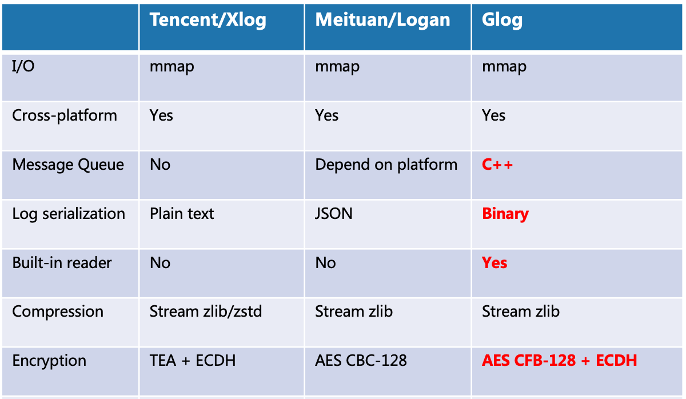

<h1 align="center">

</h1>

[](https://github.com/HuolalaTech/Glog)
[](https://raw.githubusercontent.com/HuolalaTech/Glog/master/LICENSE) 
[](https://github.com/HuolalaTech/Glog/pulls) 
[](https://github.com/HuolalaTech/Glog/wiki)

> [中文文档](https://github.com/huolalatech/hll-wp-glog/blob/master/README-zh.md) | 
> [Introduction](https://juejin.cn/post/7168662263337861133/)

---

> Glog: General Log 

Glog is a high-performance, cross-platform mobile logging component. Use mmap I/O, support synchronous/asynchronous write mode, format log with custom binary format, SDK user can choose whatever mechanism you like(eg. JSON, Protobuf). The underlaying file format is flexible, high-performance and fault-tolerant. Glog support log compression, encryption and cleanup, also includes reading module written by C++

## I. WHY CHOOSE
Most of the logging component takes over the data serialization process, convert data object to binary data by JSON or other mechanism, then write binary data to file. The advantage of this is easy to use, but lack of flexible. Glog decouple the serialization process with underlaying log, remain high performance and reliable.



Technical implementation
- mmap I/O
- Customized binary file format, store each log with binary data, upper layer is responsible for serialization(Protobuf is recommended).Add sync mark to the end of each log to support fault-tolerant.
- Stream compression to reduce CPU usage
- Encrypt each log by AES CFB-128 and ECDH
- Support synchronous/asynchronous write mode, asynchronous mode implemented by message queue written by C++
- Support incremental archive(per day) and full archive(per file)
- Build-in read module

### Benchmark
| Phone model | Log SDK | 10K write | 100K write |
| --- | --- | --- | --- |
| Samsung Galaxy S10+ Android 11 | glog | 21 ms | 182 ms |
|| glog+pb | 54 ms | 335 ms |
|| xlog | 207 ms | 1961 ms |
|| logan | 250 ms | 6469 ms |
| Huawei Honor Magic 2 Android 10 | glog | 38 ms | 286 ms |
|| glog+pb | 84 ms | 505 ms |
|| xlog | 263 ms | 2165 ms |
|| logan | 242 ms | 3643 ms |
|Xiaomi 10 Android 11| glog | 27 ms | 244 ms |
|| xlog | 198 ms | 1863 ms |
|| logan | 210 ms | 4238 ms |
| Huawei Mate 40 pro HarmonyOS 2.0.0 | glog | 30 ms | 257 ms |
|| xlog | 275 ms | 2484 ms |
|| logan | 260 ms | 4020 ms |
| OPPO R11 Android 8.1.0 | glog | 63 ms | 324 ms |
|| glog+pb | 234 ms | 1611 ms |
|| xlog | 464 ms | 3625 ms |
|| logan | 430 ms | 5355 ms |
| iPhone 12 128G iOS 14.8 | glog | 7 ms | 29 ms |
|| xlog | 152 ms | 1079 ms |
|| logan | 162 ms | 12821 ms |
| iPhone 8 64G iOS 13.7 | glog | 12 ms | 50 ms |
|| xlog | 242 ms | 2106 ms |
|| logan | 251 ms | 38312 ms |

## II. HOW TO USE

### Android

#### IMPORT
The latest release is available on [Maven Central](https://search.maven.org/artifact/cn.huolala.glog.android/glog-android-static/1.0.0/aar).

```groovy
allprojects {
    repositories {
        mavenCentral()
    }
}
```

```groovy
dependencies {
    implementation "cn.huolala.glog.android:glog-android-static:1.0.0"
    // implementation "cn.huolala.glog.android:glog-android-shared:1.0.0"
}
```

#### QUIC START
```java
public class SampleApp extends Application {
    private Glog glog;

    @Override
    public void onCreate() {
        super.onCreate();
        // Global initialization, setup internal log level for debug
        Glog.initialize(BuildConfig.DEBUG ? InternalLogLevelDebug : InternalLogLevelInfo);
        setup();
    }

    // initialize instance
    private void setup() {
        glog = new Glog.Builder(getApplicationContext())
                .protoName("glog_identify")         // instance identity, instance with same identity will create only once
                .encryptMode(Glog.EncryptMode.AES)  // Encryption mode
                .key("")                            // ECDH Server public key
                .incrementalArchive(true)           // Incremental archive，log within a day write to same file
                .build();
    }

    // write log
    private void write() {
        byte[] data = serialize();                  // serizlize data
        glog.write(data);                           // write binary data
    } 

    // read log
    private void read() {
        ArrayList<String> logFiles = new ArrayList<>();
        glog.getArchiveSnapshot(logFiles, 10, 100 * 1024); // get snapshot of log files list, flush cache if log num >= 10 or log size >= 100KB in cache
        byte[] inBuffer = new byte[Glog.getSingleLogMaxLength()];
        for (String logFile : logFiles) {
            try (Glog.Reader reader = glog.openReader(logFile)) {
                while (true) {
                    int n = reader.read(inBuffer);
                    if (n < 0) {
                        break;
                    } else if (n == 0) { // fault-tolerant
                        continue;
                    }
                    byte[] outBuffer = new byte[n];
                    System.arraycopy(inBuffer, 0, outBuffer, 0, n);
                    deserialize(outBuffer); // deserialize binary data
                }
            } catch (IOException e) {
                e.printStackTrace();
            }
        }
    }

}
```

### iOS

#### IMPORT
```
    pod 'Glog'
```

#### QUIC START
```
    // initialize default instance
    Glog *glog = [Glog defaultGlog];
    // write data
    glog.write(data);
    // get snapshot of log files list, flush cache if log num >= 10 or log size >= 100KB in cache
    NSArray *logFiles = [self.glog getArchiveSnapshot:true minLogNum:10 totalLogSize:100 * 1024];
    NSMutableArray *dataArr = [NSMutableArray new];
    for (NSString *item in logFiles) {
        GlogReader *reader = [self.glog openReader:item];
        NSInteger length = 0;
        NSData *data;
        do {
            length = [reader read:16 * 1024 data:&data];
            if (length == 0) { // fault-tolerant
                continue;
            } else if (length < 0){
                break;
            }
            if (data) {
                NSString *dataString = [[NSString alloc] initWithData:data encoding:NSASCIIStringEncoding];
                [dataArr addObject:dataString];
            }
        } while (YES);
        NSLog(@"all the data: %@",dataArr);
        [self.glog closeReader:reader];
    }
    
```

## III. TOOLS
- Misc/Reader
- Misc/generate-ecc-key.py

## IV. AUTHOR
[HuolalaTech](https://juejin.cn/user/1768489241815070)


## V. LICENSE
-------

```
Copyright 2022 Huolala, Inc.

Licensed under the Apache License, Version 2.0 (the "License");
you may not use this file except in compliance with the License.
You may obtain a copy of the License at

   http://www.apache.org/licenses/LICENSE-2.0

Unless required by applicable law or agreed to in writing, software
distributed under the License is distributed on an "AS IS" BASIS,
WITHOUT WARRANTIES OR CONDITIONS OF ANY KIND, either express or implied.
See the License for the specific language governing permissions and
limitations under the License.
```